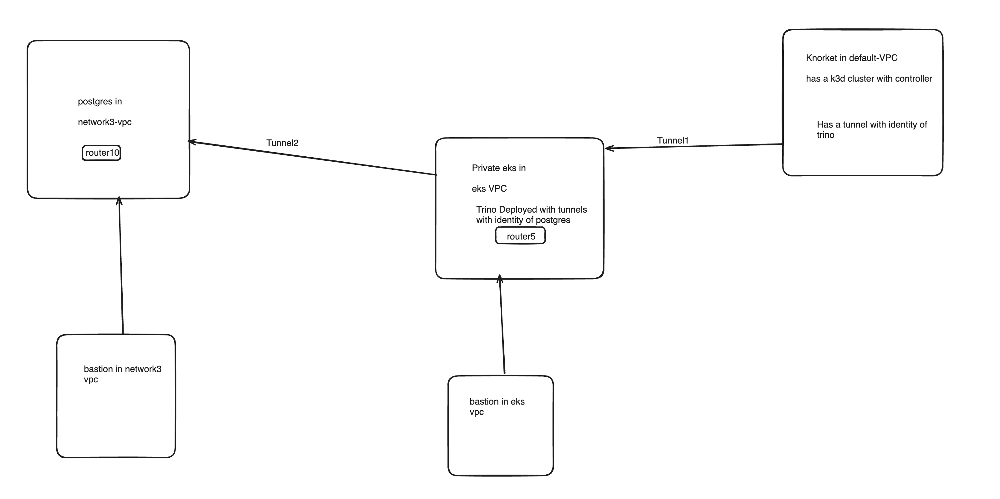

## Setup Order

### Follow steps from the relevant folders:

1. Controller in knorket
2. Postgres
3. Trino cluster
4. Then access Trino from Trino 

For the Ziti network to work, we need:
  - Controllers
  - Routers
  - Tunnels

The controller will act as a central body.

The router is deployed on the private network from where you want to expose services. If you have a VPC and then you install the router there, that means the router can reach all IPs on that VPC. To expose an application, you need to map that IP.

### Here is how we would set up:

#### For Controller Installation:
Provision a separate EC2 instance.

- Follow `controller.sh` under knorket
- Make note of the username and password to connect

#### For Router Installation:

If it is a Linux machine:
- Follow `postgres/router.sh`

If in Kubernetes, use the Helm chart:
- Follow `trino-eks/router.sh`

If you want to allow some service to connect via the router:

- Map it as done in `postgres/service.sh`

#### For Tunnel Installation:
- Via nodeagent (follow `trino-eks/tunnels.sh`)
- Via Linux service (follow [Ziti Tunneler for Linux](https://openziti.io/docs/reference/tunnelers/linux/debian-package))
